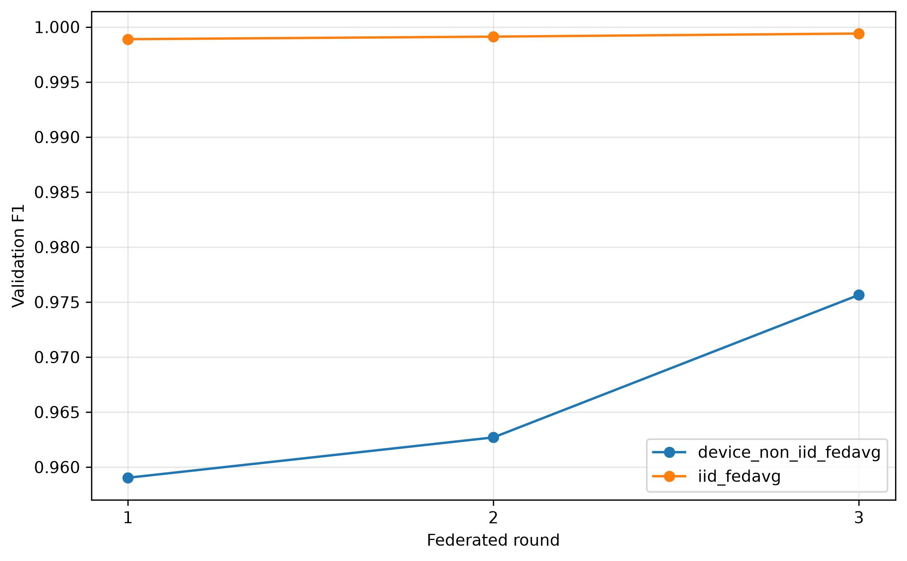
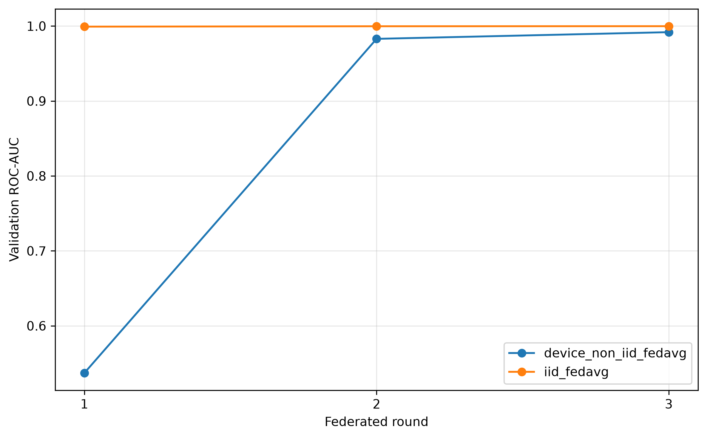
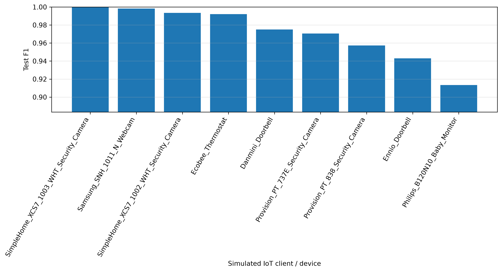
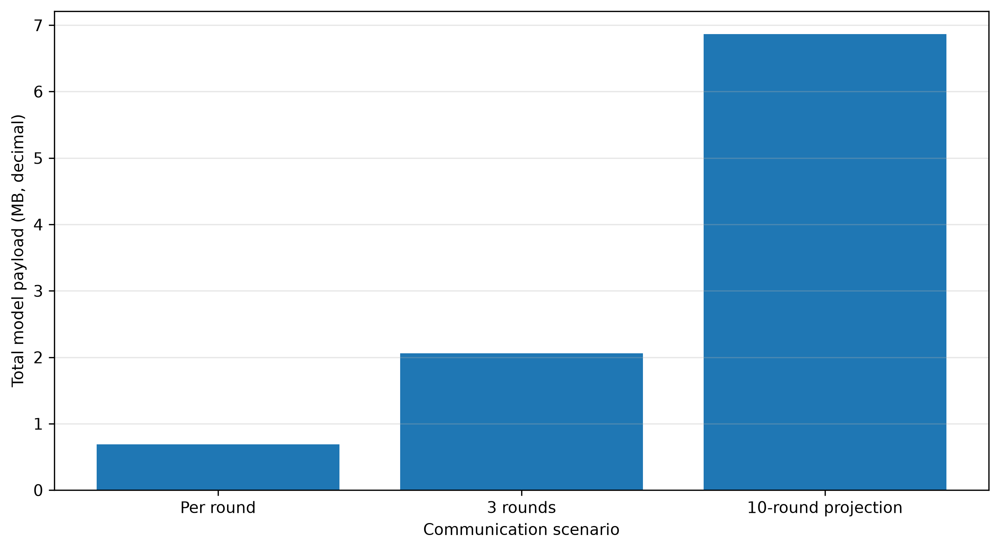
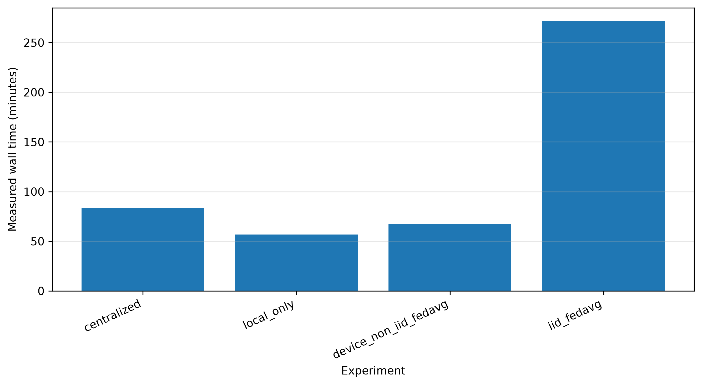
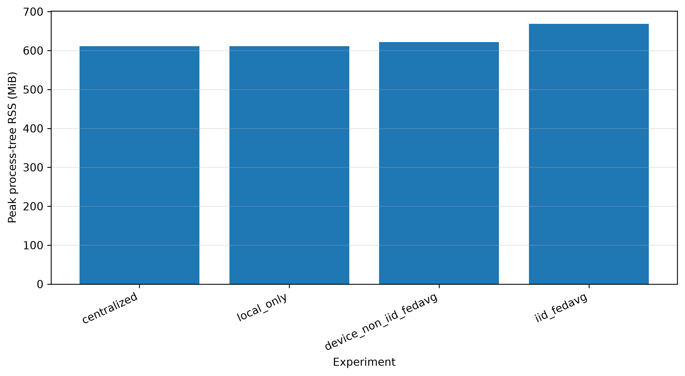

# Federated Learning for Intrusion Detection in IoT Networks: An Empirical Evaluation of FedAvg Performance, Resource Costs, and Communication Overhead

## Abstract
*(Section to be completed in Stage 3)*

## 1. Introduction
*(Section to be completed in Stage 3)*

## 2. Related Work
*(Section to be completed in Stage 3)*

## 3. Methodology Overview
*(Section to be completed in Stage 3)*

## 4. Experimental Setup

### 4.1 Dataset and Data Partitioning
This study evaluates intrusion detection models using the N-BaIoT (Network-Based Detection of IoT Botnet Attacks) dataset [2]. The dataset comprises network traffic statistics collected from 9 distinct commercial IoT device types: Danmini Doorbell, Ecobee Thermostat, Ennio Doorbell, Philips B120N10 Baby Monitor, Provision PT-737E Security Camera, Provision PT-838 Security Camera, Samsung SNH-1011 N Webcam, SimpleHome XCS7-1002 WHT Security Camera, and SimpleHome XCS7-1003 WHT Security Camera. 

The primary task is binary intrusion detection, distinguishing benign network traffic (Class `0`) from malicious attack traffic (Class `1`), which encompasses Mirai and Gafgyt botnet attack vectors. Each network observation is represented by 115 continuous numerical features capturing packet arrival statistics, sizes, and jitter across five temporal decay windows (100 ms, 500 ms, 1.5 s, 10 s, 1 min) and four aggregation streams (Source-IP, Source-MAC-IP, Channel/Socket, Socket-Pair).

The complete dataset contains 7,062,606 observations. To ensure rigorous evaluation without data leakage [8], a frozen split specification was generated using a fixed random seed of 42. Partitioning was performed at the `(device, feature_hash)` level within each IoT device source, ensuring that identical feature-vector groups within a device were kept indivisible and assigned exclusively to one split boundary. The resulting split allocation comprises:
* **Training Set:** 4,943,824 rows (70.00%)
* **Validation Set:** 1,059,394 rows (15.00%)
* **Test Set:** 1,059,388 rows (15.00%)

Using this frozen training data, three client partitioning configurations were established:
1. **Device-Level Non-IID Partition:** The 9 physical IoT device sources are mapped directly to 9 simulated logical federated learning clients. Client dataset sizes reflect natural device traffic proportions, ranging from 248,850 training rows (Ennio Doorbell) to 769,074 training rows (Philips Baby Monitor). This setup models non-identically distributed (Non-IID) data skewed by device functionality and usage patterns.
2. **Controlled IID Partition:** The 4,943,824 training observations were redistributed deterministically across 9 simulated logical clients using class-stratified random assignment (seed 42). Each client receives approximately 549,313 to 549,315 training rows with matching benign and attack class proportions. This partition serves as an experimental control to isolate non-IID distribution effects from algorithm behavior.
3. **Local-Only Setup:** The 9 device-level logical clients train isolated local models strictly on their own local device training partition. No parameter sharing or communication occurs between clients.

The 9 clients represent simulated logical participants executing within a single-host execution environment rather than physical edge hardware nodes deployed over a wireless network.

### 4.2 Data Preprocessing
Feature standardization is performed using Scikit-Learn's `StandardScaler`. Features are transformed to zero mean and unit variance according to:
$$z = \frac{x - \mu}{\sigma}$$

In the experimental implementation, `StandardScaler` was fitted incrementally (`fit_training_scaler_incremental`) strictly over the combined 4,943,824 training rows prior to federated partitioning, and persisted to disk (`data/processed/preprocessing/training_standard_scaler.pkl`). All validation and test partitions were transformed using these fixed training mean ($\mu$) and standard deviation ($\sigma$) vectors without refitting.

*Methodological Note & Federated Limitation:* Fitting the scaler centrally across pooled training data was selected to ensure uniform feature scaling across centralized, local-only, and federated experiments. However, because global feature statistics ($\mu, \sigma$) were computed centrally prior to client partitioning, this preprocessing pipeline does not represent a fully decentralized edge pipeline. In an actual edge deployment, computing global feature statistics across isolated participants would require a federated analytics protocol.

### 4.3 Model Architecture
All experiments evaluate a lightweight feed-forward Multi-Layer Perceptron (`SmallMLP`) implemented in PyTorch (`src/models/mlp.py`). The architecture consists of:
* **Input Layer:** 115 continuous features
* **Hidden Layer 1:** 64 linear units followed by Rectified Linear Unit (ReLU) activation
* **Hidden Layer 2:** 32 linear units followed by Rectified Linear Unit (ReLU) activation
* **Output Layer:** 1 linear unit followed by Sigmoid activation, producing an estimated probability $p \in [0, 1]$ of attack traffic.

The network contains exactly **9,537 trainable parameters**, calculated as:
$$\text{Layer 1 Weights \& Biases: } (115 \times 64) + 64 = 7,424$$
$$\text{Layer 2 Weights \& Biases: } (64 \times 32) + 32 = 2,080$$
$$\text{Output Layer Weights \& Biases: } (32 \times 1) + 1 = 33$$
$$\text{Total Parameters: } 7,424 + 2,080 + 33 = 9,537$$

Training minimizes Binary Cross-Entropy loss over batch predictions:
$$\mathcal{L}_{BCE} = -\frac{1}{N} \sum_{i=1}^N \left[ y_i \log(\hat{y}_i) + (1 - y_i) \log(1 - \hat{y}_i) \right]$$

### 4.4 Training Configuration
Models were trained using the Adam optimizer with a fixed learning rate of $\alpha = 0.001$ and a batch size of 256 samples. Random seeds were fixed to 42 across NumPy and PyTorch. All computations were executed on CPU.

*Configured Maximums vs. Executed Runs:*
While project configuration files (`configs/experiment.yaml`) specify upper bounds allowing up to 10 epochs or rounds, the empirical experiments completed and reported in this manuscript executed the following parameters:
* **Centralized Baseline:** 3 full training epochs over the 4,943,824 pooled training rows.
* **Local-Only Baseline:** 3 training epochs for each of the 9 independent local device client models.
* **Federated Learning (FedAvg):** 3 communication rounds, with $E = 1$ local epoch per round for each client.
* **Client Participation:** Full client participation in every round ($C = 1.0$, 9 out of 9 clients participating).

### 4.5 Federated Learning Procedure
Federated experiments execute the standard Federated Averaging (FedAvg) algorithm [1] (`src/fl/coordinator.py`). For each communication round $r \in \{1, 2, 3\}$:
1. **Global Model Broadcast:** The central coordinator serializes the global model parameter state dictionary $W^{r-1}$ and distributes a copy to all 9 participating clients.
2. **Local Training:** Each client $k \in \{1, \dots, 9\}$ instantiates a local model initialized with $W^{r-1}$ and trains locally for $E = 1$ epoch over its assigned training subset $D_k$ ($n_k = |D_k|$) using Adam ($\alpha = 0.001$, batch size 256).
3. **State Upload:** Upon local training completion, each client returns its updated parameter state dictionary $W_k^r$ and sample count $n_k$ to the coordinator.
4. **Weighted Aggregation:** The coordinator computes the updated global parameter state dictionary $W^r$ via sample-weighted parameter averaging:
   $$W^r = \sum_{k=1}^{K} \frac{n_k}{N} W_k^r \quad \text{where } N = \sum_{k=1}^K n_k = 4,943,824, \; K = 9$$
5. **Global Model Update:** The global model parameters are updated with $W^r$ to complete the round.

Transmission involves full model parameter state dictionaries (`state_dict`), not loss gradients.

### 4.6 Baselines
Four experimental conditions were evaluated to isolate data distribution and collaboration effects:
1. **Centralized Baseline:** Model trained on pooled global training data. Represents the empirical upper bound for model learning capacity without data distribution boundaries.
2. **Local-Only Baseline:** 9 isolated models trained independently on single-device data. Represents performance when clients do not participate in collaborative training.
3. **Device-Level Non-IID FedAvg:** FedAvg executed across the 9 natural device partitions. Measures collaborative learning performance under real-world device distribution heterogeneity [5]–[7].
4. **Controlled IID FedAvg:** FedAvg executed across 9 class-stratified IID partitions. Isolates FedAvg algorithmic convergence from device non-IID skew.

### 4.7 Evaluation Protocol
Model performance is evaluated across six metrics: Loss, Accuracy, Precision, Recall, F1-Score, and ROC-AUC. Classification decisions use a fixed probability threshold of 0.5 ($p \ge 0.5 \rightarrow \text{Attack}$).

*Evaluation Scope Distinction:*
* **Global Test Scope:** The Centralized model, IID FedAvg global model, and Device Non-IID FedAvg global model are evaluated on the complete, frozen global test set (1,059,388 rows across all 9 devices).
* **Local-Only Test Scope:** Each Local-Only model is evaluated strictly on the test partition belonging to its corresponding device (sample sizes ranging from 53,325 to 164,801 rows; summing to 1,059,388 rows total). Both macro-averages (equal weight per client) and sample-weighted averages are reported. Validation and test sets were evaluated strictly using the pre-fitted training scaler without refitting.

### 4.8 Communication Payload Accounting
Communication cost is evaluated using a model parameter state dictionary payload accounting model (`experiments/scripts/measure_communication.py`). 

* **State Dict Payload Size:** The `SmallMLP` model contains 9,537 float32 parameters (4 bytes per parameter), yielding a tensor weight payload of **38,148 bytes** (~37.25 KiB / 0.03815 MB).
* **Per-Client Per-Round Exchange:** Each participating client downloads 1 global model state dictionary (38,148 bytes) and uploads 1 updated model state dictionary (38,148 bytes), totaling **76,296 bytes** (~74.51 KiB) per client per round.
* **Per-Round Total (9 Clients):** $9 \times 76,296 = 686,664 \text{ bytes}$ (~0.655 MiB / 0.687 MB) per round.
* **3-Round Experiment Total:** $3 \times 686,664 = 2,059,992 \text{ bytes}$ (~1.96 MiB / 2.06 MB).

*Explicit Accounting Scope:* These figures represent theoretical model tensor payload accounting. They do NOT represent measured network socket traffic, nor do they include TCP/IP packet headers, TLS/SSL encryption overhead, HTTP/gRPC frame headers, serialization/deserialization overhead, payload compression, network latency, or packet retransmission.

### 4.9 Resource Measurement
Resource overhead was measured during experiment execution using process-tree Resident Set Size (RSS) monitoring via Python `psutil` (v7.2.2) sampled at 0.1-second intervals (`experiments/scripts/measure_resource_usage.py`).

* **Centralized Baseline (3 epochs):** Peak RSS = 610.94 MiB (640,614,400 bytes), Wall Time = 5,018.94 s (~83.6 min).
* **Local-Only Baseline (3 epochs):** Peak RSS = 610.95 MiB (640,630,784 bytes), Wall Time = 3,402.99 s (~56.7 min).
* **Device Non-IID FedAvg (3 rounds):** Peak RSS = 621.54 MiB (651,730,944 bytes), Wall Time = 4,034.84 s (~67.2 min).
* **IID FedAvg (3 rounds):** Peak RSS = 668.36 MiB (700,821,504 bytes), Wall Time = 16,290.68 s (~271.5 min).

*Measurement Scope:* Reported peak RSS reflects host RAM allocated to the Python process tree on CPU execution. Runtimes and memory usage represent single-host simulation performance and do not measure edge device battery drain, physical hardware RAM constraints, or energy consumption.

### 4.10 Reproducibility Statement
To ensure full reproducibility, the repository includes fixed random seed definitions (seed 42), frozen split index specifications (`data/processed/splits/split_specification.txt`), persisted StandardScaler binaries (`training_standard_scaler.pkl`), complete experiment configurations (`configs/experiment.yaml`), and raw experiment output logs (`results/raw/`). The complete codebase and results packaging scripts are maintained at `https://github.com/Moazzam9/federated-iot-ids`.

---

## 5. Results

### 5.1 Overall Final-Test Performance
The primary evaluation results on the frozen holdout test set across all four experimental conditions are presented in Table 1. Models were evaluated using the frozen StandardScaler parameters fitted on training data, with predictions evaluated at a fixed classification threshold of 0.5.

**Table 1: Final holdout test set evaluation results.**
*Note: Centralized, Device Non-IID FedAvg, and IID FedAvg models were evaluated on the global test set (1,059,388 samples). Local-Only models were evaluated on their respective device-specific test subsets (summing to 1,059,388 samples total); both macro and sample-weighted averages across the 9 device models are reported.*

| Experiment | Evaluation Scope | Test Rows | Loss | Accuracy | Precision | Recall | F1-Score | ROC-AUC |
| :--- | :--- | :---: | :---: | :---: | :---: | :---: | :---: | :---: |
| **Centralized Baseline** | Global Test Set | 1,059,388 | 0.051443 | 0.994635 | 0.994216 | 0.999994 | 0.997097 | 0.996899 |
| **Controlled IID FedAvg (Round 3)** | Global Test Set | 1,059,388 | 0.005075 | 0.998949 | 0.999193 | 0.999667 | 0.999430 | 0.999859 |
| **Device Non-IID FedAvg (Round 3)** | Global Test Set | 1,059,388 | 0.129260 | 0.954104 | 0.952555 | 0.999990 | 0.975696 | 0.992387 |
| **Local-Only (Macro Average)** | Same-Device Test Subsets | 1,059,388 | 0.313455 | 0.946415 | 0.945825 | 0.999971 | 0.971422 | 0.994417 |
| **Local-Only (Weighted Average)** | Same-Device Test Subsets | 1,059,388 | 0.315096 | 0.943251 | 0.942662 | 0.999976 | 0.969684 | 0.994566 |

On the global test set, the Centralized baseline model achieved an F1-Score of **0.997097**, an Accuracy of **0.994635**, and a Loss of **0.051443**. Under the controlled class-stratified IID partition, IID FedAvg after 3 rounds reached an F1-Score of **0.999430**, an Accuracy of **0.998949**, and a Loss of **0.005075**. Under the natural device-based Non-IID partition, Device Non-IID FedAvg after 3 rounds reached an F1-Score of **0.975696**, an Accuracy of **0.954104**, and a Loss of **0.129260**.

For the Local-Only baseline, where 9 independent models were trained on single-device partitions, the macro-averaged F1-Score across the 9 local evaluations was **0.971422** (Accuracy: **0.946415**, Loss: **0.313455**), while the sample-weighted average F1-Score was **0.969684** (Accuracy: **0.943251**, Loss: **0.315096**).

*Evaluation Scope Distinction:* As detailed in Section 4.7, the Centralized and FedAvg global models were evaluated against the entire global test set (1,059,388 rows across all 9 devices). In contrast, each Local-Only model was evaluated strictly against the test rows belonging to its corresponding device. Therefore, Local-Only metrics reflect local specialization on same-device distributions and should not be interpreted as directly equivalent in evaluation scope to the global-model metrics.

---

### 5.2 FedAvg Convergence Across Rounds
The progression of validation set metrics across the 3 communication rounds for Device Non-IID FedAvg and Controlled IID FedAvg is detailed in Table 2. Validation metrics were evaluated on the global validation set (1,059,394 rows) at the end of each round.

**Table 2: Global validation performance across communication rounds for FedAvg partitions.**

| Partition | Round | Training Samples | Aggregation Time (s) | Round Wall Time (s) | Loss | Accuracy | Precision | Recall | F1-Score | ROC-AUC |
| :--- | :---: | :---: | :---: | :---: | :---: | :---: | :---: | :---: | :---: | :---: |
| **Device Non-IID** | 1 | 4,943,824 | 0.006371 | 828.88 | 0.828505 | 0.921285 | 0.921285 | 1.000000 | 0.959030 | 0.537014 |
| **Device Non-IID** | 2 | 4,943,824 | 0.004894 | 805.37 | 0.283213 | 0.928603 | 0.928078 | 0.999998 | 0.962697 | 0.982908 |
| **Device Non-IID** | 3 | 4,943,824 | 0.005069 | 778.94 | 0.133517 | 0.954014 | 0.952468 | 0.999989 | 0.975650 | 0.991824 |
| **Controlled IID** | 1 | 4,943,824 | 0.005771 | 5213.75 | 0.009921 | 0.997956 | 0.999254 | 0.998528 | 0.998890 | 0.999194 |
| **Controlled IID** | 2 | 4,943,824 | 0.003809 | 4730.39 | 0.006481 | 0.998382 | 0.999254 | 0.998990 | 0.999122 | 0.999705 |
| **Controlled IID** | 3 | 4,943,824 | 0.004017 | 4739.48 | 0.005061 | 0.998900 | 0.999142 | 0.999665 | 0.999403 | 0.999801 |

  
*Figure 1: Validation F1-Score progression across communication rounds for Device Non-IID and Controlled IID FedAvg.*

  
*Figure 2: Validation ROC-AUC progression across communication rounds for Device Non-IID and Controlled IID FedAvg.*

For Device Non-IID FedAvg, validation performance improved steadily over the three measured rounds:
* Validation Loss decreased from **0.828505** in Round 1 to **0.283213** in Round 2, and further to **0.133517** in Round 3.
* Validation F1-Score increased from **0.959030** (Round 1) to **0.962697** (Round 2) and **0.975650** (Round 3), representing an overall gain of **+0.016620** (+1.66 percentage points).
* Validation ROC-AUC exhibited a substantial increase from **0.537014** in Round 1 to **0.982908** in Round 2 and **0.991824** in Round 3, representing an absolute change of **+0.454809**.

For Controlled IID FedAvg, validation performance started at a high baseline in Round 1 and changed modestly across subsequent rounds:
* Validation Loss decreased from **0.009921** (Round 1) to **0.006481** (Round 2) and **0.005061** (Round 3).
* Validation F1-Score shifted from **0.998890** in Round 1 to **0.999122** in Round 2 and **0.999403** in Round 3, representing a change of **+0.000513**.
* Validation ROC-AUC moved from **0.999194** in Round 1 to **0.999705** in Round 2 and **0.999801** in Round 3, representing a change of **+0.000608**.

---

### 5.3 Local-Only Device-Level Results
Table 3 details the individual performance of the 9 local-only models on their respective device-specific test subsets. Each local model was trained for 3 epochs using only data originating from that specific IoT device.

**Table 3: Local-Only model test evaluation performance by individual IoT device source.**

| Device Identifier | Test Samples | Loss | Accuracy | Precision | Recall | F1-Score | ROC-AUC |
| :--- | :---: | :---: | :---: | :---: | :---: | :---: | :---: |
| **Danmini_Doorbell** | 152,744 | 0.407299 | 0.951343 | 0.951343 | 1.000000 | 0.975065 | 0.987414 |
| **Ecobee_Thermostat** | 125,381 | 0.061210 | 0.984320 | 0.984320 | 1.000000 | 0.992098 | 0.995744 |
| **Ennio_Doorbell** | 53,325 | 0.758990 | 0.892339 | 0.892088 | 1.000000 | 0.942967 | 0.986173 |
| **Philips_B120N10_Baby_Monitor** | 164,801 | 0.622557 | 0.840565 | 0.840555 | 1.000000 | 0.913371 | 0.997396 |
| **Provision_PT_737E_Security_Camera** | 124,239 | 0.356412 | 0.943971 | 0.942885 | 1.000000 | 0.970603 | 0.993009 |
| **Provision_PT_838_Security_Camera** | 125,533 | 0.535976 | 0.921264 | 0.918077 | 0.999991 | 0.957285 | 0.997157 |
| **Samsung_SNH_1011_N_Webcam** | 56,283 | 0.011711 | 0.997015 | 0.996647 | 0.999897 | 0.998269 | 0.999943 |
| **SimpleHome_XCS7_1002_WHT_Security_Camera** | 129,458 | 0.046649 | 0.987703 | 0.987254 | 0.999910 | 0.993542 | 0.999340 |
| **SimpleHome_XCS7_1003_WHT_Security_Camera** | 127,624 | 0.020290 | 0.999216 | 0.999255 | 0.999944 | 0.999599 | 0.993573 |

  
*Figure 3: Final test F1-Score breakdown for Local-Only models evaluated on individual device test partitions.*

Observed test performance varied across the 9 local device models:
* Test F1-Scores ranged from **0.913371** (Philips B120N10 Baby Monitor) to **0.999599** (SimpleHome XCS7-1003 WHT Security Camera).
* Test Loss ranged from **0.011711** (Samsung SNH-1011 N Webcam) to **0.758990** (Ennio Doorbell).
* All 9 local models exhibited high Recall values ($\ge 0.999897$), while Precision varied between **0.840555** (Philips Baby Monitor) and **0.999255** (SimpleHome 1003 Security Camera).
* The unweighted macro-average across all 9 local models was **0.971422** for F1-Score, **0.946415** for Accuracy, and **0.313455** for Loss.
* The sample-weighted average across all 9 local models was **0.969684** for F1-Score, **0.943251** for Accuracy, and **0.315096** for Loss.

---

### 5.4 Communication Cost
Communication volume was calculated based on the model state dictionary payload accounting model (`experiments/scripts/measure_communication.py`). Results are summarized in Table 4.

**Table 4: Model parameter payload communication volume accounting.**

| Scenario | Rounds | Participating Clients | Download (Bytes) | Upload (Bytes) | Total Exchange (Bytes) | Total (MiB) | Total (MB Decimal) | Accounting Status |
| :--- | :---: | :---: | :---: | :---: | :---: | :---: | :---: | :--- |
| **Per Client per Round** | 1 | 1 | 38,148 | 38,148 | 76,296 | 0.072762 | 0.076296 | Per-round estimate |
| **All Clients per Round** | 1 | 9 | 343,332 | 343,332 | 686,664 | 0.654854 | 0.686664 | Per-round estimate |
| **Measured 3-Round Experiment** | 3 | 9 | 1,029,996 | 1,029,996 | 2,059,992 | 1.964561 | 2.059992 | Executed experiments |
| **Configured 10-Round Projection** | 10 | 9 | 3,433,320 | 3,433,320 | 6,866,640 | 6.548538 | 6.866640 | Linear projection |

  
*Figure 4: Cumulative model parameter payload transmission volume across communication rounds.*

Key communication payload measurements:
* The `SmallMLP` model parameter state dictionary contains 9,537 float32 values, requiring **38,148 bytes** (~37.25 KiB / 0.038148 MB).
* For each communication round, one client downloads 1 state dictionary (38,148 bytes) and uploads 1 updated state dictionary (38,148 bytes), yielding **76,296 bytes** (~74.51 KiB) per client per round.
* Across all 9 participating clients, the total parameter transfer per round is **686,664 bytes** (~0.654854 MiB / 0.686664 MB).
* For the completed 3-round FedAvg experiments, the total cumulative parameter exchange across all clients was **2,059,992 bytes** (~1.964561 MiB / 2.059992 MB).
* If projected linearly to the configured maximum of 10 rounds, the estimated payload exchange would be **6,866,640 bytes** (~6.548538 MiB / 6.866640 MB). *Note: No 10-round experiment was executed.*

*Accounting Scope Disclaimer:* As stated in Section 4.8, these figures represent model tensor payload accounting based on parameter state dictionary size. They do NOT represent measured network socket traffic and do not include TCP/IP headers, TLS encryption, HTTP/gRPC frame headers, serialization overhead, payload compression, network latency, or packet retransmissions.

---

### 5.5 Computational Resource Usage
Resource usage was measured during process execution via process-tree Resident Set Size (RSS) sampling at 0.1-second intervals using `psutil`. Results are reported in Table 5.

**Table 5: Computational resource usage and wall-clock execution runtimes on CPU.**

| Experiment | Status | Exit Code | Measurement Metric | Peak RSS (Bytes) | Peak RSS (MiB) | Sampling Interval (s) | Samples Collected | Execution Wall Time (s) | Wall Time (Min) |
| :--- | :---: | :---: | :--- | :---: | :---: | :---: | :---: | :---: | :---: |
| **Centralized Baseline** | Completed | 0 | Peak Process-Tree RSS | 640,614,400 | 610.9375 | 0.1 | 42,600 | 5,018.9433 | ~83.65 min |
| **Local-Only Baseline** | Completed | 0 | Peak Process-Tree RSS | 640,630,784 | 610.9531 | 0.1 | 29,202 | 3,402.9905 | ~56.72 min |
| **Device Non-IID FedAvg** | Completed | 0 | Peak Process-Tree RSS | 651,730,944 | 621.5391 | 0.1 | 35,246 | 4,034.8426 | ~67.25 min |
| **Controlled IID FedAvg** | Completed | 0 | Peak Process-Tree RSS | 700,821,504 | 668.3555 | 0.1 | 145,510 | 16,290.6821 | ~271.51 min |

  
*Figure 5: Total execution wall time across experimental conditions on CPU.*

  
*Figure 6: Observed peak process-tree RAM usage (Resident Set Size in MiB) across experimental conditions.*

Observed resource and runtime metrics:
* **Centralized Baseline (3 epochs):** Processed 4.94M training rows in **5,018.94 seconds** (~83.65 min) with a peak process-tree RSS of **610.94 MiB** (640,614,400 bytes).
* **Local-Only Baseline (3 epochs/client):** Completed training across all 9 local models in **3,402.99 seconds** (~56.72 min) with a peak RSS of **610.95 MiB** (640,630,784 bytes).
* **Device Non-IID FedAvg (3 rounds):** Completed 3 communication rounds in **4,034.84 seconds** (~67.25 min) with a peak RSS of **621.54 MiB** (651,730,944 bytes).
* **Controlled IID FedAvg (3 rounds):** Recorded an execution wall time of **16,290.68 seconds** (~271.51 min / ~4.53 hours) with a peak RSS of **668.36 MiB** (700,821,504 bytes).

*Runtime Observation:* The execution wall time for Controlled IID FedAvg (16,290.68 s) was substantially higher than that of Device Non-IID FedAvg (4,034.84 s), despite both processing the same total number of training rows (4,943,824). As noted in repository implementation documentation, this runtime difference is associated with indexing overhead in the custom PyTorch IID data partitioner across the 9 clients during epoch iteration, rather than model parameter computation time.

*Resource Scope Disclaimer:* Reported peak RSS measures RAM allocated to the Python process tree during execution on a host CPU system. Runtimes and RAM usage reflect single-host simulation performance and do not represent edge device battery consumption, hardware memory limits, or physical energy usage.

---

### 5.6 Validation-to-Test Consistency
To evaluate consistency between model selection and final holdout evaluation, Table 6 compares the final validation set metrics against the global test set metrics for the global model experiments.

**Table 6: Comparison between final validation set metrics and global holdout test set metrics.**

| Experiment | Metric | Validation Scope | Test Scope | Validation Value | Test Value | Difference (Test - Val) | Percentage Change |
| :--- | :--- | :--- | :--- | :---: | :---: | :---: | :---: |
| **Centralized** | Loss | Global Val (Epoch 3) | Global Test | 0.052471 | 0.051443 | -0.001028 | -1.96% |
| **Centralized** | Accuracy | Global Val (Epoch 3) | Global Test | 0.994549 | 0.994635 | +0.000086 | +0.01% |
| **Centralized** | Precision | Global Val (Epoch 3) | Global Test | 0.994122 | 0.994216 | +0.000094 | +0.01% |
| **Centralized** | Recall | Global Val (Epoch 3) | Global Test | 0.999996 | 0.999994 | -0.000002 | -0.00% |
| **Centralized** | F1-Score | Global Val (Epoch 3) | Global Test | 0.997050 | 0.997097 | +0.000046 | +0.00% |
| **Centralized** | ROC-AUC | Global Val (Epoch 3) | Global Test | 0.996878 | 0.996899 | +0.000021 | +0.00% |
| **Device Non-IID FedAvg** | Loss | Global Val (Round 3) | Global Test | 0.133517 | 0.129260 | -0.004258 | -3.19% |
| **Device Non-IID FedAvg** | Accuracy | Global Val (Round 3) | Global Test | 0.954014 | 0.954104 | +0.000089 | +0.01% |
| **Device Non-IID FedAvg** | Precision | Global Val (Round 3) | Global Test | 0.952468 | 0.952555 | +0.000087 | +0.01% |
| **Device Non-IID FedAvg** | Recall | Global Val (Round 3) | Global Test | 0.999989 | 0.999990 | +0.000001 | +0.00% |
| **Device Non-IID FedAvg** | F1-Score | Global Val (Round 3) | Global Test | 0.975650 | 0.975696 | +0.000046 | +0.00% |
| **Device Non-IID FedAvg** | ROC-AUC | Global Val (Round 3) | Global Test | 0.991824 | 0.992387 | +0.000564 | +0.06% |
| **Controlled IID FedAvg** | Loss | Global Val (Round 3) | Global Test | 0.005061 | 0.005075 | +0.000014 | +0.28% |
| **Controlled IID FedAvg** | Accuracy | Global Val (Round 3) | Global Test | 0.998900 | 0.998949 | +0.000049 | +0.00% |
| **Controlled IID FedAvg** | Precision | Global Val (Round 3) | Global Test | 0.999142 | 0.999193 | +0.000051 | +0.01% |
| **Controlled IID FedAvg** | Recall | Global Val (Round 3) | Global Test | 0.999665 | 0.999667 | +0.000002 | +0.00% |
| **Controlled IID FedAvg** | F1-Score | Global Val (Round 3) | Global Test | 0.999403 | 0.999430 | +0.000027 | +0.00% |
| **Controlled IID FedAvg** | ROC-AUC | Global Val (Round 3) | Global Test | 0.999801 | 0.999859 | +0.000058 | +0.01% |

Across all three global model conditions, validation set performance and holdout test set performance showed close numerical agreement:
* For the **Centralized baseline**, F1-Score was **0.997050** on validation and **0.997097** on test ($\Delta = +0.000046$). Loss was **0.052471** on validation and **0.051443** on test ($\Delta = -0.001028$).
* For **Device Non-IID FedAvg**, F1-Score was **0.975650** on validation and **0.975696** on test ($\Delta = +0.000046$). Loss was **0.133517** on validation and **0.129260** on test ($\Delta = -0.004258$).
* For **Controlled IID FedAvg**, F1-Score was **0.999403** on validation and **0.999430** on test ($\Delta = +0.000027$). Loss was **0.005061** on validation and **0.005075** on test ($\Delta = +0.000014$).

---

### 5.7 Summary of Empirical Findings
1. **Holdout Test Performance:** On the global holdout test set (1,059,388 rows), Centralized baseline achieved F1=0.997097, Controlled IID FedAvg (Round 3) achieved F1=0.999430, and Device Non-IID FedAvg (Round 3) achieved F1=0.975696. Local-Only models achieved a macro-averaged F1 of 0.971422 and a sample-weighted F1 of 0.969684 on local same-device test subsets.
2. **Convergence Behavior:** Device Non-IID FedAvg validation F1-Score increased from 0.959030 (Round 1) to 0.975650 (Round 3), while validation ROC-AUC changed from 0.537014 to 0.991824. Controlled IID FedAvg validation F1-Score moved from 0.998890 (Round 1) to 0.999403 (Round 3).
3. **Local-Only Heterogeneity:** Individual Local-Only device test F1-Scores ranged from 0.913371 (Philips Baby Monitor) to 0.999599 (SimpleHome 1003 Security Camera).
4. **Communication Volume:** The `SmallMLP` parameter state dictionary size is 38,148 bytes (~37.25 KiB). Across 9 clients and 3 rounds, total cumulative parameter exchange was 2,059,992 bytes (~1.96 MiB).
5. **Resource Runtimes and Memory:** Executed wall times on CPU ranged from 3,402.99 s (~56.7 min for Local-Only) to 16,290.68 s (~271.5 min for IID FedAvg). Peak process-tree RSS memory ranged from 610.94 MiB (Centralized) to 668.36 MiB (IID FedAvg).
6. **Validation-to-Test Stability:** Final validation set metrics and holdout test set metrics exhibited close numerical alignment across all global model experiments ($\Delta \text{F1} \le 0.000046$).

---

## 6. Discussion

### 6.1 Centralized and Federated Performance
The empirical results demonstrate distinct performance profiles across the centralized baseline, federated learning variants, and local-only models in IoT network intrusion detection [3], [4]. On the global holdout test set (1,059,388 samples), the Centralized baseline achieved an F1-Score of **0.997097** (ROC-AUC: **0.996899**), establishing an empirical reference point for model capacity when all 4.94M training observations are pooled globally. 

Under the controlled class-stratified IID partition, FedAvg reached a global test F1-Score of **0.999430** (ROC-AUC: **0.999859**) after 3 rounds. When FedAvg was executed across the natural device-level Non-IID partitions, the global model reached a test F1-Score of **0.975696** (ROC-AUC: **0.992387**). Meanwhile, the Local-Only baseline models, evaluated on their respective device-specific test subsets, yielded an unweighted macro-average F1-Score of **0.971422** and a sample-weighted average F1-Score of **0.969684**.

These observed differences illustrate the trade-offs inherent in different training topologies. Controlled IID partitioning yielded global test metrics closely matching the centralized benchmark under the 3-round execution window. In contrast, natural device-level Non-IID partitioning exhibited a lower global test F1-Score than the IID condition and centralized baseline. The observed performance difference is consistent with the effect of client-level data heterogeneity in this controlled experimental setting. However, these findings reflect the specific model, dataset, preprocessing, and training configuration evaluated, and should not be interpreted as a general proof that federated learning inherently matches or lags centralized learning across arbitrary network environments.

### 6.2 Effect of Client Data Distribution
Comparing the Controlled IID FedAvg experiment against the Device Non-IID FedAvg experiment isolates the impact of client data distribution while holding total training samples (4,943,824 rows), model architecture (`SmallMLP`, 9,537 parameters), optimizer (Adam, $\alpha = 0.001$), batch size (256), and client count ($K = 9$) constant. 

On the global holdout test set, Controlled IID FedAvg achieved an F1-Score of **0.999430**, whereas Device Non-IID FedAvg reached **0.975696**, producing an observed performance margin of **0.023734** (~2.37 percentage points). In the IID condition, training samples were redistributed such that each client received an approximately equal volume (~549,313 rows) with identical class proportions matching the global dataset. This uniform distribution produces a more similar class composition across clients, providing a less heterogeneous training condition than the natural device-level partition.

In the natural device-level Non-IID condition, dataset sizes varied substantially across clients (ranging from 248,850 rows for `Ennio_Doorbell` to 769,074 rows for `Philips_B120N10_Baby_Monitor`), reflecting the natural traffic volume and feature characteristics of individual IoT device types. Local parameter updates were influenced by device-specific traffic distributions. While sample-weighted FedAvg aggregation combined these local updates to reach a test F1-Score of **0.975696**, the natural device-level partition presented a more heterogeneous training condition than the controlled IID partition. The lower F1 observed under the device-level partition is consistent with an effect of client-level data heterogeneity [5], [6] in this experimental setting.

### 6.3 Federated Convergence Under Device-Level Heterogeneity
The validation trajectories recorded across the 3 communication rounds provide insights into the early-stage convergence dynamics of FedAvg under differing data distributions. 

For Controlled IID FedAvg, the global model achieved high validation performance in Round 1 (F1: **0.998890**, ROC-AUC: **0.999194**) and exhibited modest incremental changes through Round 2 (F1: **0.999122**, ROC-AUC: **0.999705**) and Round 3 (F1: **0.999403**, ROC-AUC: **0.999801**). The total validation F1 change from Round 1 to Round 3 was **+0.000513**, reflecting rapid early alignment due to homogeneous local data distributions.

Conversely, Device Non-IID FedAvg displayed a pronounced convergence curve over the 3 measured rounds:
* In Round 1, the model achieved a validation F1 of **0.959030** but a low ROC-AUC of **0.537014** (with validation loss at **0.828505**), indicating that initial parameter aggregation across heterogeneous device updates produced uncalibrated probability estimates across the global validation set.
* In Round 2, validation loss dropped to **0.283213**, F1 increased to **0.962697**, and ROC-AUC rose sharply to **0.982908** ($\Delta\text{ROC-AUC} = +0.445894$).
* In Round 3, validation loss further decreased to **0.133517**, F1 reached **0.975650** ($\Delta\text{F1} = +0.016620$ over Round 1), and ROC-AUC reached **0.991824** ($\Delta\text{ROC-AUC} = +0.454809$ over Round 1).

Across the three measured rounds, the device-level Non-IID condition exhibited a pronounced increase in validation ROC-AUC, whereas the IID condition showed smaller changes from an already high initial value. However, executing 3 communication rounds represents an initial execution window rather than proof of complete asymptotic convergence. Extended round execution would be required to empirically map the full convergence tail under Non-IID device skew.

### 6.4 Local-Only Device Variation
Evaluating the 9 Local-Only models on their corresponding same-device test partitions revealed substantial performance dispersion across device types. Final test F1-Scores ranged from **0.913371** on the `Philips_B120N10_Baby_Monitor` partition to **0.999599** on the `SimpleHome_XCS7_1003_WHT_Security_Camera` partition, while test loss spanned from **0.011711** (`Samsung_SNH_1011_N_Webcam`) to **0.758990** (`Ennio_Doorbell`).

All 9 local models achieved near-perfect Recall values ($\ge 0.999897$), indicating that local models consistently identified attack traffic within their local device streams. However, Precision varied considerably, dropping to **0.840555** for the Philips Baby Monitor and **0.892088** for the Ennio Doorbell. This variation indicates that a model trained only on one device's data did not exhibit uniform performance across the nine device-specific data sources.

Several factors may contribute to this observed device-level variation:
1. **Local Training Volume:** Local dataset sizes varied from 53,325 test samples (Ennio Doorbell) to 164,801 test samples (Philips Baby Monitor). Lower local sample counts provide fewer training examples for local feature fitting.
2. **Device Traffic Characteristics:** Different IoT device categories (e.g., doorbells, thermostats, webcams, baby monitors) exhibit distinct baseline traffic patterns, packet size distributions, and attack payload structures.
3. **Feature Distribution Variance:** Local models trained in isolation fit parameters tailored strictly to their local feature distributions, rendering precision sensitive to local benign/attack boundary noise.

These observations illustrate that while local-only training avoids communication overhead and data sharing, it exposes individual devices to variable detection precision depending on local data characteristics.

### 6.5 Communication and Computational Trade-offs
Evaluating system efficiency requires examining both parameter exchange payload and host computational runtime:

1. **Communication Payload Accounting:** The `SmallMLP` network architecture contains 9,537 float32 parameters, resulting in a compact model state dictionary size of **38,148 bytes** (~37.25 KiB). Under full client participation ($K = 9$), each communication round involves downloading and uploading 1 state dict per client, transferring **686,664 bytes** (~0.655 MiB) per round across all clients. Over the 3-round experiment, cumulative model parameter transfer totaled **2,059,992 bytes** (~1.96 MiB). The small parameter payload of the selected MLP results in a relatively small theoretical model-exchange volume under the assumed full-participation FedAvg protocol [1], [6].
2. **Computational Runtime and CPU Memory:** Host process execution metrics recorded peak process-tree RSS memory ranging between **610.94 MiB** (Centralized) and **668.36 MiB** (Controlled IID FedAvg). Total CPU wall-clock execution times were **5,018.94 s** (~83.65 min) for Centralized (3 epochs), **3,402.99 s** (~56.72 min) for Local-Only (3 epochs/client), **4,034.84 s** (~67.25 min) for Device Non-IID FedAvg (3 rounds), and **16,290.68 s** (~271.51 min) for Controlled IID FedAvg (3 rounds).

*Runtime Observation:* Controlled IID FedAvg exhibited a wall-clock execution time (~4.53 hours) over four times longer than Device Non-IID FedAvg (~1.12 hours), despite both processing the identical total volume of 4,943,824 training rows. The implementation documentation identifies index-based partition access in the custom IID data loader as a likely contributor to the IID runtime overhead; however, the present experiments did not perform a dedicated profiling study that isolates the contribution of this mechanism.

This comparison highlights that model parameter payload accounting and computational execution time represent distinct resource dimensions. A small model tensor size minimizes parameter exchange volume but does not eliminate CPU iteration or data-loading overheads during local epoch training.

### 6.6 Implications for Resource-Aware IoT Intrusion Detection
The empirical findings carry key implications for designing resource-aware intrusion detection systems in IoT network environments:

* **Model Compactness vs. Detection Performance:** The 9,537-parameter `SmallMLP` architecture demonstrated that a compact neural network can achieve high detection performance on N-BaIoT traffic features (Centralized F1: 0.997097, Device Non-IID FedAvg F1: 0.975696). The small parameter footprint reduces storage overhead and model transfer volume.
* **Collaboration vs. Isolation:** Local-only training eliminates network transmission entirely but produces device-dependent precision variations (F1 ranging from 0.913371 to 0.999599). Federated learning enables device collaboration without aggregating raw network logs, improving global test generalization (F1: 0.975696) across heterogeneous device traffic streams.
* **Data Heterogeneity Considerations:** Real-world IoT deployments naturally feature Non-IID traffic distributions across device types. The observed performance gap between IID FedAvg (F1: 0.999430) and Device Non-IID FedAvg (F1: 0.975696) underscores that data heterogeneity remains a primary factor influencing global model quality. System designers must account for non-IID skew when deploying federated intrusion detection models.
* **Resource Dimension Disconnect:** Optimizing a system solely for parameter size or communication payload does not guarantee low computational execution runtime. System evaluation must account for local data loading, training epoch iteration, and coordinator aggregation alongside parameter exchange volume.

### 6.7 Interpretation Boundaries
To maintain scientific rigor, the conclusions drawn from this study must be interpreted within the specific boundaries of the experimental design:

1. **Global Preprocessing Scaler Fitting:** As detailed in Section 4.2, `StandardScaler` parameters ($\mu, \sigma$) were fitted globally on the combined training set prior to partitioning. While this ensured consistent feature scaling across baselines, it does not represent a fully decentralized edge pipeline. In an actual edge deployment, computing global feature statistics would require an initial federated analytics step.
2. **Evaluation Scope Heterogeneity:** Global models (Centralized, FedAvg) were evaluated against the entire global test set (1,059,388 rows), whereas Local-Only models were evaluated against device-specific test subsets. Local-Only macro/weighted averages reflect local specialization rather than global generalization.
3. **Communication Accounting vs. Actual Network Traffic:** Reported communication bytes represent theoretical model parameter state dictionary payload calculations (`state_dict`). They do not measure physical network socket traffic, nor do they account for TCP/IP headers, TLS encryption, HTTP/gRPC frames, payload compression, serialization overhead, latency, or packet drops.
4. **Process RSS Memory vs. Hardware Edge Constraints:** Reported memory metrics reflect host process-tree Resident Set Size (RSS) during CPU simulation execution. They do not measure edge device hardware RAM limits, micro-controller memory bounds, or physical battery/energy consumption.
5. **Single Random Seed & Short Execution Window:** All experiments were conducted using a single random seed (42) across 3 communication rounds (or 3 epochs). The findings reflect a single empirical execution run; statistical variance across multiple random seeds and long-term convergence over extended rounds remain unmeasured.
6. **Absence of Formal Privacy Guarantees:** Vanilla FedAvg avoids centralizing raw training observations on a server. However, it does not incorporate Differential Privacy ($\epsilon, \delta$) or Secure Aggregation mechanisms. Exchanged model weights remain vulnerable to gradient/parameter reconstruction or membership inference attacks; no formal privacy protection is claimed or proven.

---

## 7. Limitations and Threats to Validity

### 7.1 Randomness and Training Horizon
All primary empirical experiments reported in this study were executed using a single random seed (`seed = 42`) across a 3-round federated training horizon (or 3 centralized/local epochs). Fixing seed 42 ensured exact deterministic execution across experimental scripts. However, because the experiments were conducted with a single random seed, the reported metrics characterize one realized training trajectory rather than an estimate of variability across repeated runs. The sensitivity of model parameter initialization, mini-batch shuffling, and client partitioning to different random seeds remains unmeasured.

Furthermore, executing 3 communication rounds ($E=1$ local epoch per round) characterizes performance evolution over three measured communication rounds rather than long-term asymptotic convergence behavior. While project configuration files (`configs/experiment.yaml`) specify upper bounds allowing up to 10 rounds or epochs, no 10-round training runs were executed. The 10-round figures reported in Section 5.4 are linear payload projections from the per-round accounting model. Extended training horizons under different random initializations should be evaluated in future research.

### 7.2 Federated Preprocessing Assumptions
In this experimental design, feature standardization via `StandardScaler` ($\mu, \sigma$) was fitted incrementally over the combined global training set (4,943,824 rows) prior to client partitioning (`training_standard_scaler.pkl`). This methodological choice ensured identical, stable feature scaling across centralized, local-only, and federated experiments, preventing scaling disparities from confounding baseline comparisons.

However, obtaining global feature means ($\mu$) and standard deviations ($\sigma$) requires prior centralized access to pooled client training data. As a result, the preprocessing pipeline does not represent a fully decentralized edge system. In an actual edge deployment where raw data cannot be centrally pooled prior to training, feature standardization would require a federated preprocessing protocol (e.g., federated calculation of feature means and variances) or local per-client normalization.

### 7.3 Simulated Clients and Deployment Realism
The 9 logical clients evaluated in this study correspond directly to the 9 commercial IoT device traffic sources present in the N-BaIoT dataset. While this partitioning reflects authentic device-level data heterogeneity, the execution environment was a single-host CPU simulation. 

Consequently, the experimental setup represents a controlled simulation of device-level data heterogeneity rather than a physical IoT deployment. The evaluation did not instantiate physical micro-controller hardware nodes, wireless network interfaces (e.g., Wi-Fi, Ethernet, Cellular), network middleboxes, edge gateway servers, real-time packet capture engines, or client battery constraints. Wireless channel interference, network jitter, physical packet drops, and real-world edge hardware execution were not present in the simulation environment.

### 7.4 Evaluation-Scope Differences
As documented in Section 4.7, a structural difference exists in evaluation scope between global models and local-only models:
* **Global Models (Centralized, IID FedAvg, Device Non-IID FedAvg):** Evaluated against the entire frozen global test set (1,059,388 rows spanning all 9 IoT devices).
* **Local-Only Models:** Evaluated strictly against the test subset belonging to each model's corresponding device (ranging from 53,325 to 164,801 rows per device). Macro-averages and sample-weighted averages summarize these 9 local evaluations.

While this protocol evaluates each model type according to its intended operational scope—global models on global network traffic and local models on local device traffic—the resulting test metrics answer related but distinct evaluation questions. Direct numerical comparisons between local-only averages and global-model metrics should be interpreted with this scope difference in mind.

### 7.5 Communication Measurement Boundaries
The communication volume figures reported in Section 5.4 were derived using a model parameter state dictionary payload accounting model (`experiments/scripts/measure_communication.py`). The calculation computes the raw weight tensor size of the `SmallMLP` state dictionary (9,537 float32 parameters $\times$ 4 bytes = 38,148 bytes) and assumes full client participation ($C=1.0$) with 1 upload and 1 download per client per round (76,296 bytes per client/round; 2.06 MB cumulative across 3 rounds).

These figures represent theoretical model tensor payload accounting based on parameter state dictionary size under an explicit protocol assumption. They do NOT represent measured network socket traffic. The accounting model does not include:
* Transport protocol headers (TCP/IP, UDP, IPv6)
* Application layer framing overheads (HTTP/2, gRPC, Protobuf)
* Cryptographic wrappers (TLS/SSL handshakes, transport encryption)
* Data serialization/deserialization overhead
* Payload compression algorithms
* Network latency, round-trip delays, packet retransmission, or network socket buffering.

In a physical deployment, actual bandwidth usage would depend on transport framing, security protocols, payload compression, and network conditions.

### 7.6 Computational and Hardware Scope
Resource overhead was evaluated by monitoring host process-tree Resident Set Size (RSS memory) and execution wall-clock time using Python `psutil` at 0.1-second sampling intervals on a CPU host system. 

Reported peak memory values (610.94 MiB to 668.36 MiB) reflect Python process-tree RAM allocated on a single x86_64 CPU workstation. They do not measure edge device hardware RAM limits (e.g., embedded micro-controllers with KB/MB memory limits), edge GPU memory, or physical memory constraints of low-power IoT gateways. Similarly, execution runtimes reflect host CPU process execution times and do not measure edge processor clock speeds, thermal throttling, hardware power draw, CPU energy consumption, or device battery drain.

### 7.7 Dataset Characteristics and Duplicate Structure
All empirical evaluations were performed on the N-BaIoT dataset (7,062,606 rows across 9 commercial IoT devices). A dataset-wide duplicate audit (`data/processed/splits/split_specification.txt`) revealed:
* **Total Observations:** 7,062,606 rows
* **Unique Feature Vectors:** 2,482,676 unique rows
* **Duplicate Observations:** 4,579,930 duplicate rows across 1,891,636 duplicate groups
* **Cross-Label Feature Conflicts:** 0 cross-label conflicts (no identical feature vector possesses conflicting benign and attack labels)
* **Cross-Device Feature Groups:** 1,871,053 feature vector groups appear across multiple devices
* **Maximum Duplicate Multiplicity:** 36 identical occurrences

To prevent data leakage [8], the frozen split generator enforced strict `(device, feature_hash)` grouping within each device partition, ensuring that duplicate feature-vector groups within a device were kept indivisible and assigned exclusively to one split boundary (train, val, or test). However, repeated feature observations remain an intrinsic property of the N-BaIoT dataset. The presence of frequent identical feature vectors across time windows may assist models in learning frequent attack signatures, representing a dataset-specific characteristic.

### 7.8 Model and Algorithm Scope
The scope of model learning and optimization evaluated in this paper is subject to specific structural boundaries:
* **Model Architecture:** All experiments evaluated a single compact feed-forward neural network (`SmallMLP`: 115 $\rightarrow$ 64 $\rightarrow$ 32 $\rightarrow$ 1, 9,537 parameters). Convolutional Neural Networks (CNNs), Recurrent Neural Networks (RNNs/LSTMs), Transformers, decision trees, or deep architectures were not evaluated.
* **Optimization Setup:** All training used the Adam optimizer ($\alpha = 0.001$, batch size 256) with Binary Cross-Entropy loss. Alternative optimizers (e.g., SGD with momentum) or hyperparameter variations were not explored.
* **Federated Algorithm:** Experiments evaluated standard Federated Averaging (FedAvg) [1]. Alternative federated optimization methods designed for non-IID data—such as FedProx [9], SCAFFOLD [10], FedNova, or personalized federated learning algorithms—were not evaluated.

### 7.9 Privacy and Security Scope
While federated learning avoids centralizing raw device network logs on a central server, the standard FedAvg implementation evaluated in this paper does NOT incorporate formal privacy-preserving primitives:
* **Differential Privacy:** No local or global Differential Privacy ($\epsilon, \delta$) mechanisms [11], [12] (such as DP-SGD or gradient noise injection) were applied.
* **Secure Aggregation:** No cryptographic Secure Aggregation [13] (e.g., secret sharing or homomorphic encryption) was implemented.
* **Attacking Robustness:** No empirical privacy attacks (e.g., gradient inversion, parameter reconstruction, or membership inference attacks) or security threat models (e.g., Byzantine client poisoning [14], [15] or backdoor attacks) were evaluated.

Exchanged model parameter weights remain theoretically susceptible to parameter reconstruction or membership inference attacks. The study evaluates distributed model training performance, model exchange payload accounting, and host resource overhead, not formal privacy protection or adversarial robustness.

### 7.10 IID and Participation Assumptions
Two key structural assumptions were applied in the federated experimental setup:
1. **Controlled IID Partition:** The Controlled IID experiment redistributes training samples across 9 clients using class-stratified random assignment as a controlled experimental benchmark to isolate data heterogeneity effects. It is an artificial control condition, not a model of real-world IoT deployment traffic distributions. Real IoT networks naturally feature non-IID device traffic distributions.
2. **Full Client Participation:** All 9 clients participated in every communication round ($C = 1.0$). The evaluation did not model client dropout, intermittent wireless connectivity, partial client selection ($C < 1.0$), asynchronous client updates, or straggler client delays.

### 7.11 Threats to Internal and External Validity

#### Internal Validity
Threats to internal validity concern factors that could influence the observed experimental measurements within the host simulation environment:
* **Single Random Seed:** Measurements reflect a single realized seed (`seed = 42`) across 3 training rounds; seed-dependent variance remains unassessed.
* **Preprocessing Pre-fitting:** Pre-fitting `StandardScaler` on global training data introduces central feature statistics into all client transformations.
* **Data Loader Indexing Overhead:** As noted in Section 5.5, the higher execution wall time observed for Controlled IID FedAvg (16,290.68 s) relative to Device Non-IID FedAvg (4,034.84 s) reflects index-slicing overhead in the custom PyTorch data partitioner during local epoch iteration. This represents a software implementation characteristic rather than an intrinsic algorithmic complexity bound.

#### External Validity
Threats to external validity concern the generalizability of the findings to broader IoT security deployments:
* **Dataset & Task Scope:** Findings are bounded by the N-BaIoT dataset (9 commercial IoT devices, binary benign vs. botnet attack classification). Results should not be assumed to generalize directly to other IoT datasets, multi-class attack classification, or different network protocols.
* **Environment Scope:** Host CPU execution on a single workstation does not replicate physical edge hardware constraints, wireless channel dynamics, or edge server topologies.
* **Algorithmic Scope:** Performance dynamics under FedAvg with `SmallMLP` may not predict the behavior of alternative federated aggregation algorithms or larger deep learning models.

---

## 8. Conclusion and Future Work

### 8.1 Conclusion
This study presented a controlled empirical investigation of federated learning for IoT intrusion detection using the N-BaIoT dataset. The evaluation compared standard Federated Averaging (FedAvg) under natural device-level Non-IID partitions and an artificial Controlled IID partition against two reference topologies: a centralized global baseline and isolated local-only models across nine commercial IoT devices.

Within the evaluated experimental setup (9,537-parameter `SmallMLP`, binary classification, 4,943,824 training rows, 1,059,388 test rows, single seed 42, 3 training rounds or epochs), the empirical findings indicate:

1. **Centralized Baseline Reference:** The Centralized model reached a global holdout test F1-Score of **0.997097** (ROC-AUC: **0.996899**), establishing a baseline for network-wide detection performance when training data are centrally aggregated.
2. **Local-Only Model Heterogeneity:** Training isolated models per device eliminated network parameter exchange but produced substantial performance dispersion across device types. Test F1-Scores ranged from **0.913371** (Philips Baby Monitor) to **0.999599** (SimpleHome 1003 Security Camera), yielding an unweighted macro-average F1-Score of **0.971422** and a sample-weighted average F1-Score of **0.969684** on local same-device test subsets.
3. **Device-Level Non-IID FedAvg:** When trained across natural device-level partitions, FedAvg achieved a global holdout test F1-Score of **0.975696** (ROC-AUC: **0.992387**). Over the 3 measured rounds, validation ROC-AUC rose from **0.537014** (Round 1) to **0.991824** (Round 3), demonstrating early-stage metric progression across heterogeneous device streams.
4. **Controlled IID Benchmark:** Under class-stratified IID partitioning, FedAvg achieved a global holdout test F1-Score of **0.999430** (ROC-AUC: **0.999859**), exhibiting small metric changes from Round 1 (F1: **0.998890**) through Round 3 (F1: **0.999403**).

These observed results show that client data distribution influenced federated model performance in this experimental setting. The Controlled IID benchmark achieved global test metrics closely matching the centralized reference, whereas the natural device-level partition reached a lower final test F1-Score and exhibited larger metric changes between early and later validation rounds.

From an efficiency perspective, the compact `SmallMLP` parameter footprint (9,537 parameters; 38,148 bytes per state dictionary) required a cumulative theoretical parameter payload of **2,059,992 bytes** (~1.96 MiB) across 9 clients over 3 rounds. Host CPU process measurements recorded peak process-tree RSS memory between **610.94 MiB** and **668.36 MiB**, with execution wall-clock runtimes ranging from **3,402.99 s** (~56.7 min for Local-Only) to **16,290.68 s** (~271.5 min for Controlled IID FedAvg).

In summary, the study provides reproducible empirical evidence regarding performance trade-offs across centralized, local, and federated learning topologies under IID and Non-IID device distributions. However, these findings are bounded by the specific experimental configuration evaluated and do not establish universal statements regarding all IoT network environments or federated learning protocols.

### 8.2 Future Work
To address the methodological and scope boundaries documented in Section 7, future research should explore the following directions:

1. **Multi-Seed Statistical Evaluation:** Repeat experimental executions across multiple random seeds to measure statistical variance, report standard deviations, and compute confidence intervals for performance and convergence metrics.
2. **Extended Federated Training Horizons:** Evaluate federated training across extended round schedules beyond the 3-round horizon to empirically characterize long-term asymptotic convergence tails under non-IID device skew.
3. **Decentralized and Federated Preprocessing:** Investigate federated preprocessing protocols (such as federated calculation of feature means and variances) or local client feature normalization strategies to eliminate reliance on centrally pre-fitted global `StandardScaler` parameters.
4. **Heterogeneous and Dynamic Client Environments:** Benchmark federated performance under partial client participation ($C < 1.0$), client dropout, straggler delays, severe class/volume imbalance, and non-stationary temporal traffic drift.
5. **Broader Intrusion Datasets and Multi-Class Evaluation:** Extend empirical evaluations to additional IoT intrusion detection benchmarks (such as TON_IoT, Bot-IoT, or CICIoT2023) and multi-class attack classification taxonomies.
6. **Alternative Federated Algorithms:** Compare standard FedAvg [1] against federated aggregation algorithms specifically designed for non-IID distributions (such as FedProx [9], SCAFFOLD [10], or FedNova) as well as personalized federated learning frameworks.
7. **Alternative Model Architecture Scope:** Evaluate additional model architectures, including decision trees, linear models, CNNs, LSTMs, and deep neural network variants tailored for resource-constrained edge computing.
8. **Physical Network Socket and Protocol Benchmarking:** Measure actual network socket traffic, transport framing overheads (TCP/IP, HTTP/2, gRPC), serialization latency, packet loss, bandwidth constraints, compression, and TLS encryption costs in a networked environment.
9. **Formal Privacy and Security Primitives:** Incorporate and empirically evaluate Differential Privacy ($\epsilon, \delta$) [11], [12], Secure Aggregation protocols [13], and resilience against adversarial security threat models, including membership inference, parameter reconstruction, and client poisoning attacks [14], [15].
10. **Physical Edge Hardware Deployment:** Benchmark model training and inference on physical IoT edge hardware nodes (such as micro-controllers, Raspberry Pi devices, or edge gateways) to measure physical RAM limits, CPU thermal throttling, and physical battery/power consumption.
11. **Hierarchical and Asynchronous Topologies:** Study gateway-assisted hierarchical aggregation, asynchronous client parameter updates, and network fault tolerance in distributed IoT deployments.
12. **Cross-Dataset Generalization:** Evaluate cross-dataset transferability and model generalization across heterogeneous physical deployment environments and unseen IoT traffic distributions.

---

## References

[1] H. B. McMahan, E. Moore, D. Ramage, S. Hampson, and B. Agüera y Arcas, "Communication-efficient learning of deep networks from decentralized data," in *Proceedings of the 20th International Conference on Artificial Intelligence and Statistics (AISTATS)*, PMLR 54:1273–1282, 2017.

[2] Y. Meidan, M. Bohadana, Y. Mathov, Y. Mirsky, A. Shabtai, D. Breitenbacher, and Y. Elovici, "N-BaIoT—Network-based detection of IoT botnet attacks using deep autoencoders," *IEEE Pervasive Computing*, vol. 17, no. 3, pp. 12–22, Jul.–Sept. 2018. DOI: 10.1109/MPRV.2018.03367731.

[3] B. B. Zarpelão, R. S. Miani, C. T. Kawakani, and S. S. de Alvarenga, "A survey of intrusion detection in Internet of Things," *Journal of Network and Computer Applications*, vol. 84, pp. 25–37, Apr. 2017. DOI: 10.1016/j.jnca.2017.02.009.

[4] N. Chaabouni, M. Mosbah, A. Zemmari, C. Connable, and A. Elouardi, "Network intrusion detection systems for IoT environments: A review," *IEEE Access*, vol. 7, pp. 142964–142980, Sept. 2019. DOI: 10.1109/ACCESS.2019.2943141.

[5] Y. Zhao, M. Li, L. Lai, N. Suda, D. Civin, and V. Chandra, "Federated learning with non-IID data," *arXiv preprint arXiv:1806.00582*, 2018. DOI: 10.48550/arXiv.1806.00582.

[6] T. Li, A. K. Sahu, A. Talwalkar, and V. Smith, "Federated learning: Challenges, methods, and future directions," *IEEE Signal Processing Magazine*, vol. 37, no. 3, pp. 50–60, May 2020. DOI: 10.1109/MSP.2020.2975749.

[7] P. Kairouz et al., "Advances and open problems in federated learning," *Foundations and Trends® in Machine Learning*, vol. 14, no. 1–2, pp. 1–210, 2021. DOI: 10.1561/2200000083.

[8] D. Arp, E. Quiring, F. Pendlebury, A. Warnecke, F. Pierazzi, C. Wressnegger, L. Cavallaro, and K. Rieck, "Dos and don'ts of machine learning in computer security," in *Proceedings of the 31st USENIX Security Symposium*, pp. 3971–3988, Aug. 2022.

[9] T. Li, A. K. Sahu, M. Zaheer, M. Sanjabi, A. Talwalkar, and V. Smith, "Federated optimization in heterogeneous networks," in *Proceedings of Machine Learning and Systems (MLSys)*, vol. 2, pp. 429–450, 2020.

[10] S. P. Karimireddy, S. Kale, M. Mohri, S. J. Reddi, S. U. Stich, and A. T. Suresh, "SCAFFOLD: Stochastic controlled averaging for federated learning," in *Proceedings of the 37th International Conference on Machine Learning (ICML)*, PMLR 119:5132–5143, 2020.

[11] C. Dwork, "Differential privacy," in *Proceedings of the 33rd International Colloquium on Automata, Languages and Programming (ICALP)*, Springer LNCS 4052, pp. 1–12, 2006. DOI: 10.1007/11787006_1.

[12] M. Abadi, A. Chu, I. Goodfellow, H. B. McMahan, I. Mironov, K. Talwar, and L. Zhang, "Deep learning with differential privacy," in *Proceedings of the 2016 ACM SIGSAC Conference on Computer and Communications Security (CCS)*, pp. 308–318, Oct. 2016. DOI: 10.1145/2976749.2978318.

[13] K. Bonawitz, V. Ivanov, B. Kreuter, A. Marcedone, H. B. McMahan, S. Patel, D. Ramage, A. Segal, and K. Seth, "Practical secure aggregation for privacy-preserving machine learning," in *Proceedings of the 2017 ACM SIGSAC Conference on Computer and Communications Security (CCS)*, pp. 1175–1191, Oct. 2017. DOI: 10.1145/3133956.3133982.

[14] P. Blanchard, E. M. El Mhamdi, R. Guerraoui, and J. Stainer, "Machine learning with adversaries: Byzantine tolerant gradient descent," in *Advances in Neural Information Processing Systems 30 (NIPS)*, pp. 119–129, 2017.

[15] A. N. Bhagoji, S. Chakraborty, P. Mittal, and S. Calo, "Analyzing federated learning through an adversarial lens," in *Proceedings of the 36th International Conference on Machine Learning (ICML)*, PMLR 97:634–643, 2019.

